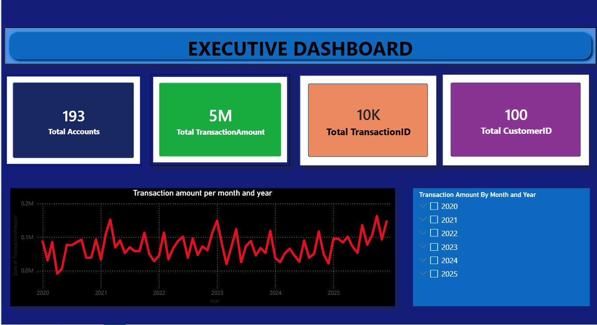
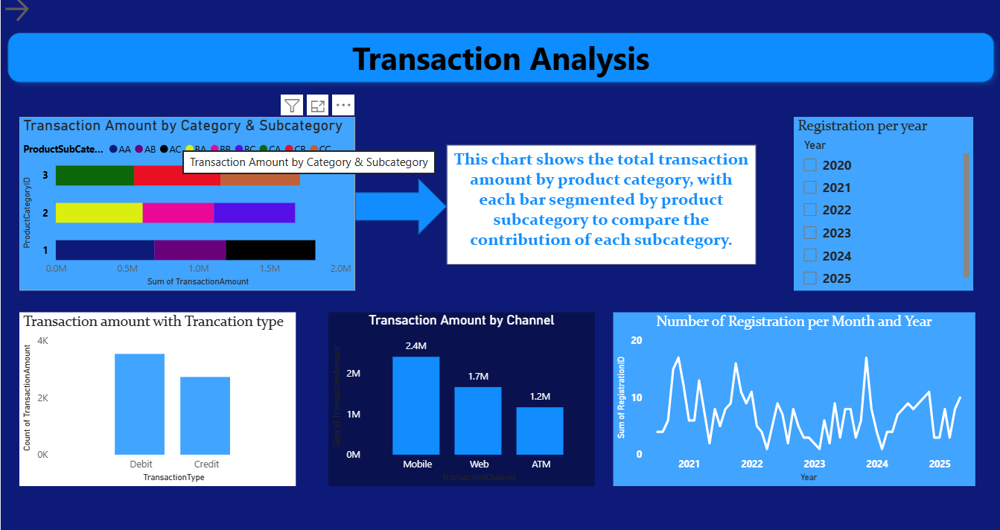
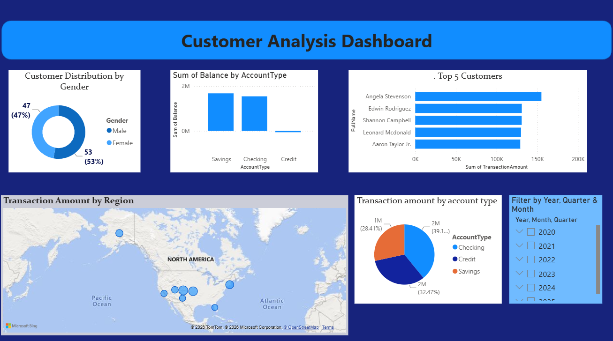

# 💳 Finance Executive Dashboard | Power BI

## 📌 Project Overview

This project is an interactive **Finance Executive Dashboard** built using **Microsoft Power BI**. It provides insights into financial transactions, customer behavior, account balances, product categories, and regional performance.

The dashboard enables users to analyze transaction trends, customer information, account types, and business performance through interactive visualizations and slicers.

---

## 📊 Dashboard Preview

### 🏠 Dashboard 1 – Executive Dashboard



**Highlights**
- Total Accounts
- Total Transaction Amount
- Total Transactions
- Total Customers
- Monthly & Yearly Transaction Trend
- Year Filter

---

### 📈 Dashboard 2 – Transaction Analysis



**Highlights**
- Transaction Amount by Product Category & Subcategory
- Transaction Amount by Channel (ATM, Web, Mobile)
- Transaction Type Analysis (Credit vs Debit)
- Registration Trend by Month & Year
- Year Filter

---

### 👥 Dashboard 3 – Customer Analysis Dashboard



**Highlights**
- Customer Distribution by Gender
- Balance by Account Type
- Top 5 Customers
- Transaction Amount by Region (Map)
- Transaction Amount by Account Type
- Year, Quarter & Month Filter

---

# 📂 Dataset

The dataset used in this project was obtained from **Kaggle** and includes multiple related tables such as:

- FactTransaction
- DimCustomer
- DimAccount
- DimProduct
- DimProductCategory
- DimProductSubCategory

The data model follows a **Star Schema**, where the fact table stores transaction records and the dimension tables provide descriptive information.

---

# 🛠 Tools & Technologies

- Microsoft Power BI Desktop
- Power Query
- DAX
- Data Modeling
- Interactive Slicers
- Maps
- Line Charts
- Column Charts
- Bar Charts
- Pie Chart
- Donut Chart
- Card Visuals

---

# 📈 Key Insights

### Executive Dashboard
- Displays total transaction amount, total customers, total accounts, and total transactions.
- Shows transaction trends over time.
- Enables year-wise filtering.

### Transaction Analysis
- Mobile transactions contribute the highest transaction amount.
- Product categories and subcategories contribute differently to overall revenue.
- Debit transactions occur more frequently than credit transactions.
- Registration trends can be analyzed across different years.

### Customer Analysis
- Female customers slightly outnumber male customers.
- Savings accounts hold the highest balance.
- Displays the top 5 customers based on transaction amount.
- Regional map visualizes transaction distribution.
- Account-type-wise transaction distribution is shown using a pie chart.

---

# 📁 Repository Structure

```
Finance-Executive-Dashboard/
│
├── finance executive dashboard.pbix
├── Dashboard.1.png
├── Dashboard.2.png
├── Dashboard.3.png
└── README.md
```

---

# 🚀 Features

- Interactive dashboards
- Cross-filtering visuals
- Clean UI design
- Dynamic slicers
- Business KPI Cards
- Customer Insights
- Transaction Analysis
- Geographic Analysis

---

# 🎯 Skills Demonstrated

- Data Cleaning
- Data Transformation
- Data Modeling
- DAX Measures
- Dashboard Design
- Data Visualization
- Business Intelligence
- Power Query
- Power BI

---

## ⭐ If you like this project, don't forget to star this repository.
